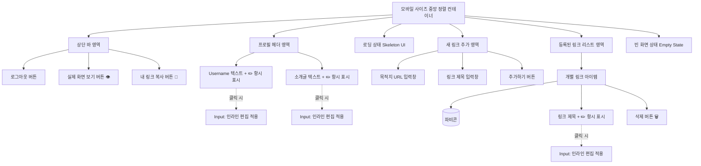

# 와이어프레임 (Wireframes) - 마이링크

본 문서는 마이링크의 핵심 화면 레이아웃과 컴포넌트 배치를 Mermaid 다이어그램, 계층 구조, 그리고 ASCII 아트를 활용하여 다각도로 정의한 와이어프레임입니다.

---

## 1. 컴포넌트 계층 구조 (Mermaid 다이어그램)



*(참고: 방문자에게 노출될 때는 탑바, 편집을 알리는 연필 아이콘, 삭제 버튼, 추가 폼 등 관리 기능을 모두 렌더링하지 않습니다.)*

---

## 2. 화면 단위 설계 (ASCII 아트 레이아웃)

### 2.1 [설계 1] 로딩 화면 (Skeleton UI)
서버에서 데이터를 불러오는 약 1초 미만의 시간 동안 화면에 렌더링되는 블록입니다.

```text
+======================================================+
| [로그아웃]                [실제화면 👁️]  [링크복사 🔗]|
|------------------------------------------------------|
|                                                      |
|   [■■■■■■■■■■]  <-- 이름 높이의 회색 박스(깜빡임)    |
|                                                      |
|   [■■■■■■■■■■■■■■■■■■■■] <-- 소개글 높이 박스        |
|                                                      |
|------------------------------------------------------|
| ▶ 리스트 로딩 스켈레톤                               |
|                                                      |
|  [■]  [■■■■■■■■■■■■■■■■■■■■■■■■■]                  |
|                                                      |
|  [■]  [■■■■■■■■■■■■■■■■■■■■■■]                     |
|                                                      |
+======================================================+
```

### 2.2 [설계 2] 소유자 뷰 - 빈 화면 (Empty State)
사용자가 갓 가입하였거나 모든 링크를 지워 데이터가 존재하지 않을 때 노출됩니다.

```text
+======================================================+
| [로그아웃]                [실제화면 👁️]  [링크복사 🔗]|
|------------------------------------------------------|
| ▶ 프로필 편집 구역                                   |
|                                                      |
|   [ Username  ✏️ ]                                   |
|   [ 소개글(Bio) 텍스트 영역  ✏️ ]                    |
|------------------------------------------------------|
| ▶ 새 링크 추가 구역                                  |
|   [ 🔗 목적지 URL (https://...)               ]      |
|   [ 📝 방문자에게 노출될 제목                 ]      |
|   [         + 새 링크 추가하기 (Button)       ]      |
|------------------------------------------------------|
| ▶ 링크 리스트 구역                                   |
|                                                      |
|                   ╭━━━━━━━━━━╮                       |
|                   ┃ 👻       ┃                       |
|                   ╰━━━━━━━━━━╯                       |
|           "아직 등록된 링크가 없네요!"               |
|   위의 입력창을 통해 첫 번째 활동 링크를 달아보세요  |
|                                                      |
+======================================================+
```

### 2.3 [설계 3] 소유자 뷰 - 일반 데이터 시각화 화면
데이터가 정상 표출된 화면입니다. 수정이 가능함을 즉각 인지할 수 있도록 텍스트 우측에 연필 아이콘(`✏️`)이 항상 노출됩니다.

```text
+======================================================+
| [로그아웃]                [실제화면 👁️]  [링크복사 🔗]|
|------------------------------------------------------|
| ▶ 프로필 편집 구역 (글씨 클릭 시 평문 -> Input 변환) |
|                                                      |
|   [ Username  ✏️ ]                                   |
|   [ 소개글(Bio) 텍스트 영역  ✏️ ]                    |
|------------------------------------------------------|
| ▶ 새 링크 추가 구역                                  |
|                                                      |
|   [ 🔗 목적지 URL (https://...)               ]      |
|   [ 📝 메뉴 제목 입력                         ]      |
|   [         + 링크 추가하기 (Button)          ]      |
|------------------------------------------------------|
| ▶ 링크 리스트 구역                                   |
|                                                      |
|  [ 🌐 파비콘 ]  [ 나의 깃허브 방문  ✏️ ]    [🗑️삭제] |
|                                                      |
|  [ 🔴 파비콘 ]  [ 영상 피드백  ✏️ ]         [🗑️삭제] |
+======================================================+
```
